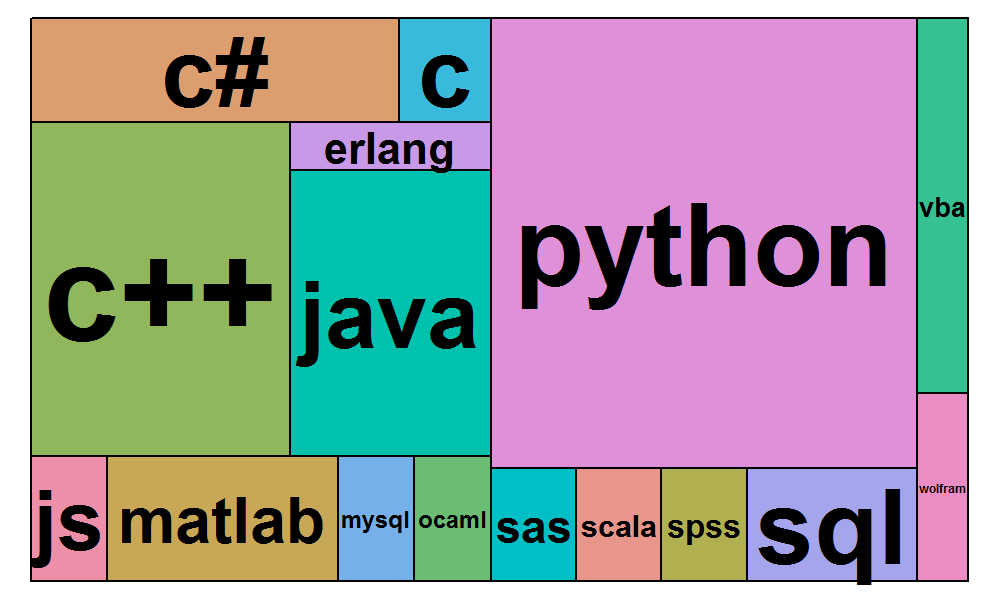
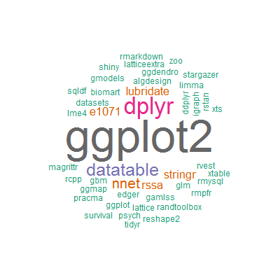
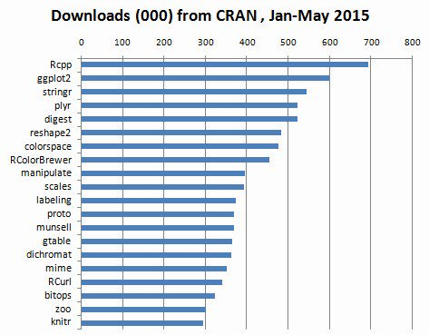
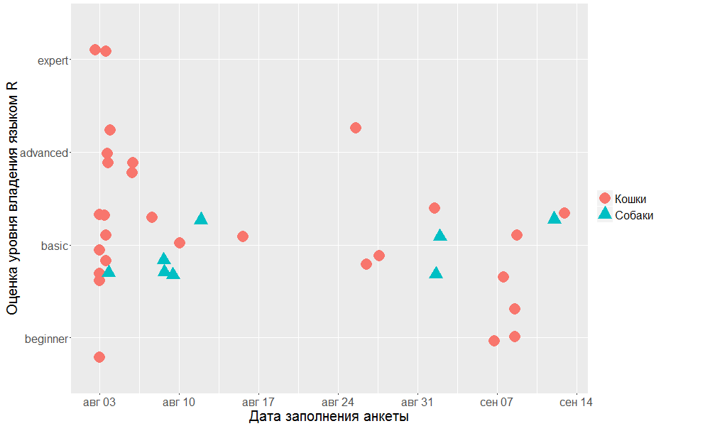

# 

Welcome!

[http://vk.com/spbrug](http://vk.com/spbrug)

Wifi: JetBrains-Open

# 

Расписание

* 14:00 Вступительное слово
* 14:10 __Филипп Управителев__ —  
        &nbsp;&nbsp;&nbsp; _Работа с Google Analytics в R: RGA package_
* 14:45 __Владислав Грозин__ — _Интерактивные веб-отчеты в R_
* 15:20 Coffee break
* 15:50 __Виталий Григорьев__ — _Item response theory_ 
* 16:25 __Анатолий Карпов__ —  
        &nbsp;&nbsp;&nbsp; _Онлайн-курс по R: опыт разработки и подведение итогов_
* 17:30 Бар "Брюгге", наб. Макарова 22

# 

Наши любимые (после R, разумеется) языки программирования:

# 

Наши любимые пакеты для R:

Слева -- результат участников группы, справа -- статистика CRAN

# 

Чем больше любишь котов, тем лучше знаешь R. Или наоборот.

<!--- this goes to Reveal.initialize
        controls: false,
        progress: false,
        autoSlide: 20000,
        loop: true,
-->

